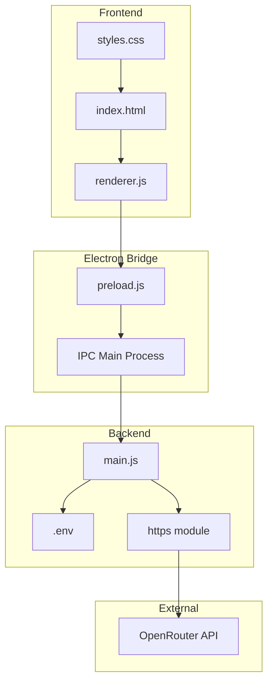
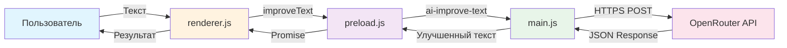

## Архитектура компонентов

```mermaid
graph TB
    subgraph "Frontend"
        HTML[index.html]
        CSS[styles.css]
        Renderer[renderer.js]
    end

    subgraph "Electron Bridge"
        Preload[preload.js]
        IPCMain[IPC Main Process]
    end

    subgraph "Backend"
        Main[main.js]
        DotEnv[.env]
        HTTPS[https module]
    end

    subgraph "External"
        OpenRouter[OpenRouter API<br/>]
    end

    HTML --> Renderer
    CSS --> HTML
    Renderer --> Preload
    Preload --> IPCMain
    IPCMain --> Main
    Main --> DotEnv
    Main --> HTTPS
    HTTPS --> OpenRouter
```

## Поток данных ИИ-функций

```mermaid
flowchart LR
    A[Пользователь] -->|Текст| B[renderer.js]
    B -->|improveText| C[preload.js]
    C -->|ai-improve-text| D[main.js]
    D -->|HTTPS POST| E[OpenRouter API]
    E -->|JSON Response| D
    D -->|Улучшенный текст| C
    C -->|Promise| B
    B -->|Результат| A

    style A fill:#e1f5fe
    style B fill:#fff3e0
    style C fill:#f3e5f5
    style D fill:#e8f5e9
    style E fill:#fce4ec
```
