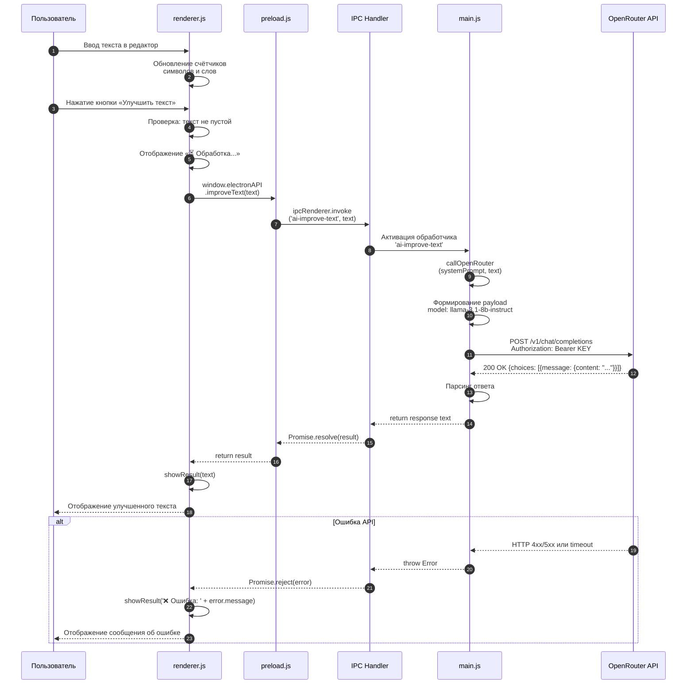
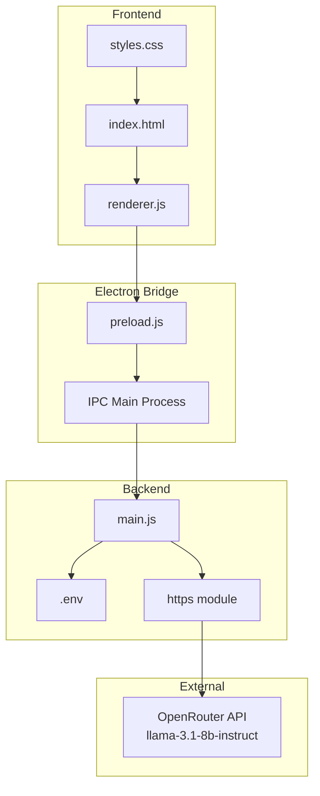
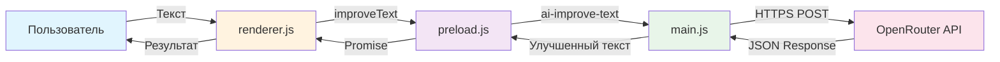

# Диаграмма последовательности — Редактор кода с ИИ-ассистентом

## Полный цикл ИИ-запроса

```mermaid
sequenceDiagram
    autonumber
    participant U as Пользователь
    participant Renderer as renderer.js
    participant Preload as preload.js
    participant IPC as IPC Handler
    participant Main as main.js
    participant API as OpenRouter API

    U->>Renderer: Ввод текста в редактор
    Renderer->>Renderer: Обновление счётчиков<br/>символов и слов

    U->>Renderer: Нажатие кнопки «Улучшить текст»
    Renderer->>Renderer: Проверка: текст не пустой
    Renderer->>Renderer: Отображение «⏳ Обработка...»

    Renderer->>Preload: window.electronAPI<br/>.improveText(text)
    Preload->>IPC: ipcRenderer.invoke<br/>('ai-improve-text', text)
    IPC->>Main: Активация обработчика<br/>'ai-improve-text'

    Main->>Main: callOpenRouter<br/>(systemPrompt, text)
    Main->>Main: Формирование payload<br/>model: llama-3.1-8b-instruct

    Main->>API: POST /v1/chat/completions<br/>Authorization: Bearer KEY
    API-->>Main: 200 OK {choices: [{message: {content: "..."}}]}

    Main->>Main: Парсинг ответа
    Main-->>IPC: return response text
    IPC-->>Preload: Promise.resolve(result)
    Preload-->>Renderer: return result
    Renderer->>Renderer: showResult(text)
    Renderer-->>U: Отображение улучшенного текста

    alt Ошибка API
        API-->>Main: HTTP 4xx/5xx или timeout
        Main-->>IPC: throw Error
        IPC-->>Renderer: Promise.reject(error)
        Renderer->>Renderer: showResult('❌ Ошибка: ' + error.message)
        Renderer-->>U: Отображение сообщения об ошибке
    end
```

## Архитектура компонентов

```mermaid
graph TB
    subgraph "Frontend"
        HTML[index.html]
        CSS[styles.css]
        Renderer[renderer.js]
    end

    subgraph "Electron Bridge"
        Preload[preload.js]
        IPCMain[IPC Main Process]
    end

    subgraph "Backend"
        Main[main.js]
        DotEnv[.env]
        HTTPS[https module]
    end

    subgraph "External"
        OpenRouter[OpenRouter API<br/>llama-3.1-8b-instruct]
    end

    HTML --> Renderer
    CSS --> HTML
    Renderer --> Preload
    Preload --> IPCMain
    IPCMain --> Main
    Main --> DotEnv
    Main --> HTTPS
    HTTPS --> OpenRouter
```

## Поток данных ИИ-функций

```mermaid
flowchart LR
    A[Пользователь] -->|Текст| B[renderer.js]
    B -->|improveText| C[preload.js]
    C -->|ai-improve-text| D[main.js]
    D -->|HTTPS POST| E[OpenRouter API]
    E -->|JSON Response| D
    D -->|Улучшенный текст| C
    C -->|Promise| B
    B -->|Результат| A

    style A fill:#e1f5fe
    style B fill:#fff3e0
    style C fill:#f3e5f5
    style D fill:#e8f5e9
    style E fill:#fce4ec
```
